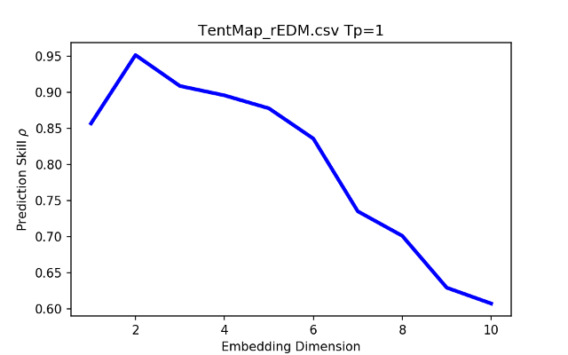
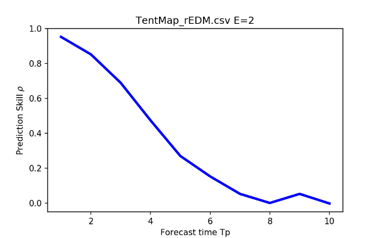
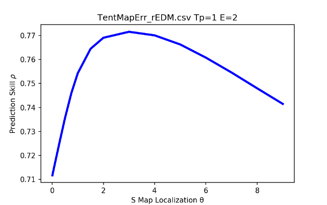
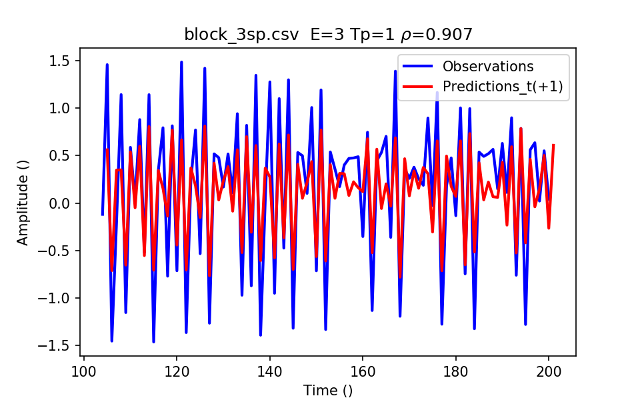
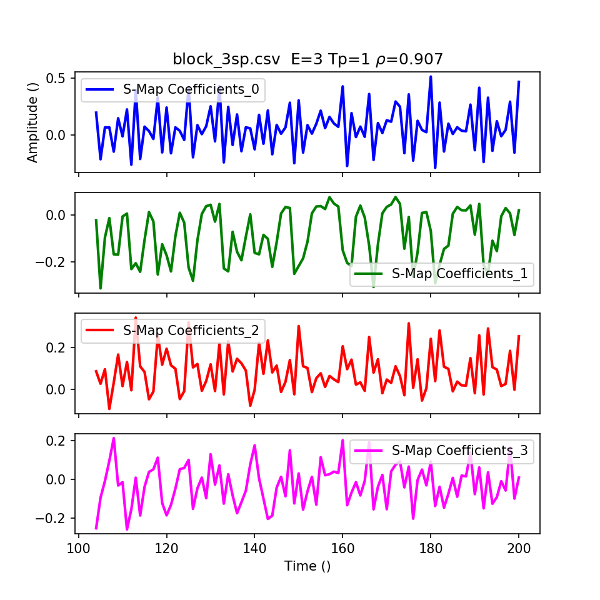
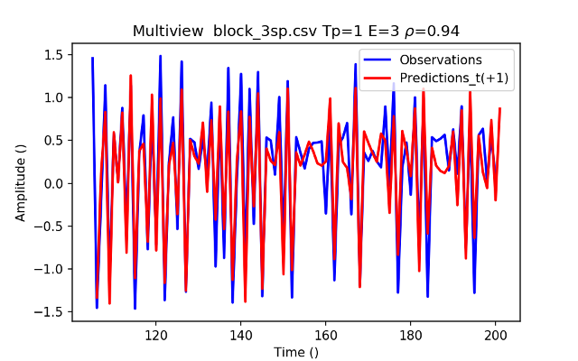
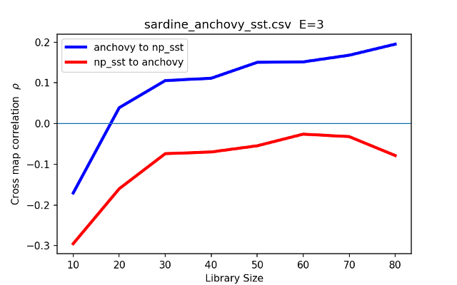

## Empirical Dynamic Modeling (EDM)
---
A Python implementation of EDM tools providing functionality similar to the R implementation [rEDM](https://cran.r-project.org/web/packages/rEDM/index.html) by Ye et. al. See the [rEDM vignette](https://cran.r-project.org/web/packages/rEDM/vignettes/rEDM-tutorial.html) for a lucid introduction to EDM. 

Functionality includes:
* Simplex projection (Sugihara and May 1990)
* Sequential Locally Weighted Global Linear Maps (S-map) (Sugihara 1994)
* Multivariate embeddings (Dixon et. al. 1999)
* Convergent cross mapping (Sugihara et. al. 2012)
* Multiview embedding (Ye and Sugihara 2016)

File|Type|Description
----|----|-----------
ArgParse.py       |Module    | Command line parser
EDM.py            |Module    | Simplex, S-map and embedding functions
Methods.py        |Module    | Applications
Embed.py          |Executable| Wrapper for Methods.EmbedData()
Predict.py        |Executable| Wrapper for EDM.Prediction()
PredictDecay.py   |Executable| Evaluate Tp from 1 to 10
SMapNL.py         |Executable| Evaluate θ from 0.01 to 9
EmbedDimension.py |Executable| Evaluate embeddings with E from 1 to 10
Multiview.py      |Executable| Multiview embedding
CCM.py            |Executable| Convergent Cross Mapping
Test.py           |Executable| Test suite
notebooks/        |          |
Jupyter.py        |Module    | Interface to IPython/Jupyter

---
### References
Sugihara G. and May R. 1990.  Nonlinear forecasting as a way of distinguishing 
chaos from measurement error in time series. Nature, 344:734–741.

Sugihara G. 1994. Nonlinear forecasting for the classification of natural 
time series. Philosophical Transactions: Physical Sciences and 
Engineering, 348 (1688) : 477–495.

Dixon, P. A., M. Milicich, and G. Sugihara, 1999. Episodic fluctuations in larval supply. Science 283:1528–1530.

Sugihara G., May R., Ye H., Hsieh C., Deyle E., Fogarty M., Munch S., 2012.
Detecting Causality in Complex Ecosystems. Science 338:496-500.

Ye H., and G. Sugihara, 2016. Information leverage in interconnected 
ecosystems: Overcoming the curse of dimensionality. Science 353:922–925.

---
## Command line examples
### Embedding dimension (E) vs prediction skill (ρ)
Evaluate simplex embedding dimensions from E = 1 to 10 on tent map data from [rEDM](https://cran.r-project.org/web/packages/rEDM/vignettes/rEDM-tutorial.html).
```
./EmbedDimension.py -i TentMap_rEDM.csv -c TentMap -l 1 100 -p 201 500 -T 1 -P
```



### Forecast interval (Tp) vs prediction skill (ρ)
Evaluate simplex prediction intervals in a 2-dimensional embedding on tent map data from [rEDM](https://cran.r-project.org/web/packages/rEDM/vignettes/rEDM-tutorial.html).
```
./PredictDecay.py -i TentMap_rEDM.csv -c TentMap -l 1 100 -p 201 500 -E 2 -P
```



### S-map localization (θ) vs prediction skill (ρ)
Evaluate S-map localization parameter in a 2-dimensional embedding on tent map data from [rEDM](https://cran.r-project.org/web/packages/rEDM/vignettes/rEDM-tutorial.html).
```
./SMapNL.py -i TentMapErr_rEDM.csv -c TentMap -l 1 100 -p 201 500 -T 1 -E 2 -P
```



### Multivariable S-map prediction
Multivariable S-map prediction on three-species data from [rEDM](https://cran.r-project.org/web/packages/rEDM/vignettes/rEDM-tutorial.html).  This corresponds to the rEDM block_lnlp() functionality. Multivariable S-map should always use -e (embedded) and -c (columns) to ensure that library and prediction matrix columns correspond to the E dimensions used in the linear decomposition and projection. One can limit k_NN to assess different prediction dynamic range and accuracy. 
```
./Predict.py -e -i block_3sp.csv -m smap -r x_t -c x_t y_t z_t -l 1 99 -p 100 198 -T 1 -t 2 -P
```




### Multiview ensemble simplex prediction
Multiview simplex prediction on three-species data from [rEDM](https://cran.r-project.org/web/packages/rEDM/vignettes/rEDM-tutorial.html).  This corresponds to the rEDM multiview() functionality.
```
./Multiview.py -i block_3sp.csv -E 3 -r x_t -c x_t y_t z_t 
-l 1 100 -p 101 200 -T 1 -P
```



### Convergent cross mapping
Convergent cross mapping on anchovy and sea surface temperature data from [rEDM](https://cran.r-project.org/web/packages/rEDM/vignettes/rEDM-tutorial.html).  This corresponds to the rEDM ccm() functionality.
```
./CCM.py -i sardine_anchovy_sst.csv -c anchovy -r np_sst -E 3 -s 100 -L 10 80 10 -R -P
```


---
## Command line arguments
pyEDM is coded in a functional paradigm for ease of understanding and use.  One exception is the command line argument parser.  The Python `ArgumentParser` class from the `argparse` module is used with all parameters stored in a namespace object: `args`.

Command line options for `Embed.py Predict.py EmbedDimension.py PredictDecay.py SMapNL.py Multiview.py CCM.py`:

Option|Long Option       |Description
------|------------------|-----------
  -h  | --help           | Show options and exit.
  -m  | --method         | Type of projection Simplex or SMap.
  -p  | --prediction     | Prediction start/stop indices.
  -l  | --library        | Library start/stop indices.
  -E  | --EmbedDimension | Embedding dimension.
  -k  | --knn            | Number of nearest neighbors.
  -N  | --noNeighborLimit| Don't limit neighbors based on Tp.
  -T  | --Tp             | Forecast interval (0 default).
  -t  | --theta          | S-Map local weighting exponent (0 default).
  -j  | --jacobians      | S-Map Jacobian columns, list of pairs.
  -svd| --SVDLeastSquares| Use SVD least squares in S-Map.
  -sig| --SVDSignificance| S-Map SVD significance (10^-5 default).
  -tr | --TikhonovAlpha  | Tikhonov regularisation initial alpha in S-Map SVD.
  -en | --ElasticNetAlpha| Elastic Net alpha in S-Map.
  -M  | --multiview      | Multiview ensemble size (sqrt(m) default).
  -u  | --tau            | Time delay (tau).
  -f  | --forwardTau     | Embed as t + tau instead of t - tau.
  -c  | --columns        | Data or embedded data column names.
  -r  | --target         | Data library target column name.
  -e  | --embedded       | Input data is an embedding.
  -L  | --libsize        | CCM Library size range [start, stop, incr].
  -s  | --subsample      | Number subsamples generated at each library.
  -R  | --randomLib      | CCM random library samples enabled.
  -S  | --seed           | CCM Random number generator seed: (None default).
  -pa | --path           | Input & Output file path.
  -i  | --inputFile      | Input observation file.
  -o  | --outputFile     | Output prediction file.
  -os | --outputSmapFile | S-map Output file.
  -oe | --outputEmbed    | Output embedded data file.
  -fs | --figureSize     | Figure size (default [5, 3]).
  -P  | --plot           | Show plot(s).
  -PX | --plotXLabel     | Plot x-axis label.
  -PY | --plotYLabel     | Plot y-axis label.
  -PD | --plotDate       | Time values are pyplot datetime numbers.
  -v  | --verbose        | Print status messages.
  -w  | --warnings       | Show warnings.
  -D  | --Debug          | Activate Debug messsages.


---
## Notes
SMapProjection() should be called with libraryMatrix and predictMatrix that have columns explicity correspondng to dimensions E. This means that if a multivariate data set is used, it should Not be called with an embedding from EmbedData() since EmbedData() will add lagged coordinates for each variable.  These extra columns will then not correspond to the intended dimensions in the matrix inversion and prediction reconstruction.  In this case, use the -e (embedded) flag so that the -c (columns) selected correspond to the proper dimension.

Jacobians of intra-variable S-Map coefficients can be stored with the -j command.  Keep in mind that the S-Map coefficients themselves are representations of the phase-space variable Jacobians with respect to time ∂C(t+1)/∂C(t).
